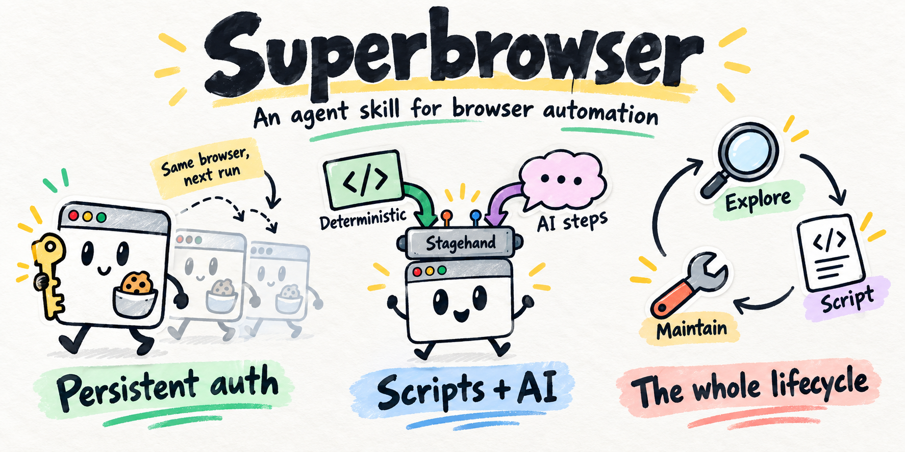

# Superbrowser

An agent skill for building and maintaining browser automations. Tell your AI agent what you want to achieve. It explores the website, handles sign-in with you, and builds a reusable TypeScript script.

Superbrowser currently supports macOS and uses a visible, persistent Chrome Dev browser with Stagehand v4.

## Install

```sh
npx skills@latest add shadowwalker/superbrowser
```

Choose your agent, such as Claude Code, Codex, or OpenCode. Add `--global` to make the skill available across projects. See the [skills CLI documentation](https://github.com/vercel-labs/skills#installation-scope) for installation options.

## Start with a task

Open your agent in a directory where the skill is available and describe the task. Include the website URL, the result you want, and where to save any downloads. For example:

```text
Use superbrowser to download photos from my child's school website: <website-url>.
Save the original photos and their descriptions in ~/Pictures/School.
Support downloading all photos, a specific date, or today by default.
```

On the first task, your agent follows the bundled setup instructions to install missing prerequisites, create `~/.superbrowser`, and open Chrome Dev. If the website requires authentication, the agent pauses while you sign in through that browser window. The same browser profile keeps your session for later runs until the website expires or revokes it.

The agent explores the relevant pages, writes the script, and verifies its result and repeat behavior. Superbrowser prefers deterministic steps for predictable behavior and low cost, with Stagehand model calls where interpretation is needed.

## Run again or repair

Ask your agent to run an existing script, set up a schedule, or investigate a failed run:

```text
Use superbrowser to run my school photo downloader for today.
```

```text
Use superbrowser to inspect the latest failed run of my school photo downloader,
repair the script, and verify it works again.
```

Each script keeps its original goal, usage instructions, configuration, exploration notes, and run logs. Expired sign-in produces a notification and an authentication status. After you sign in, the next manual or scheduled run resumes.

Run one automation at a time against the shared browser. Scheduling and unattended agent repair require a configured scheduler or agent integration; your agent can help set those up.

## Your automation workspace

Scripts share dependencies and utilities in `~/.superbrowser`, regardless of the directory where you started your agent:

```text
~/.superbrowser/
├── AGENTS.md
├── README.md          # Index of available scripts
├── package.json
├── utils/
└── scripts/
    └── <script-name>/
        ├── README.md  # Goal, commands, findings, and repair history
        ├── main.ts
        ├── config.json
        ├── exploration/
        └── logs/
```

Bun runs TypeScript directly. With Node, scripts compile into `dist/` before execution. The browser profile lives at `~/.agents/browsers/default`, overridable with `SUPER_BROWSER_DATA_DIR`.

The self-contained [skill](skills/superbrowser/SKILL.md) includes references for [setup](skills/superbrowser/references/setup.md), [exploration](skills/superbrowser/references/exploration.md), [scripting](skills/superbrowser/references/scripting.md), and [scheduled runs and repair](skills/superbrowser/references/operations.md).
